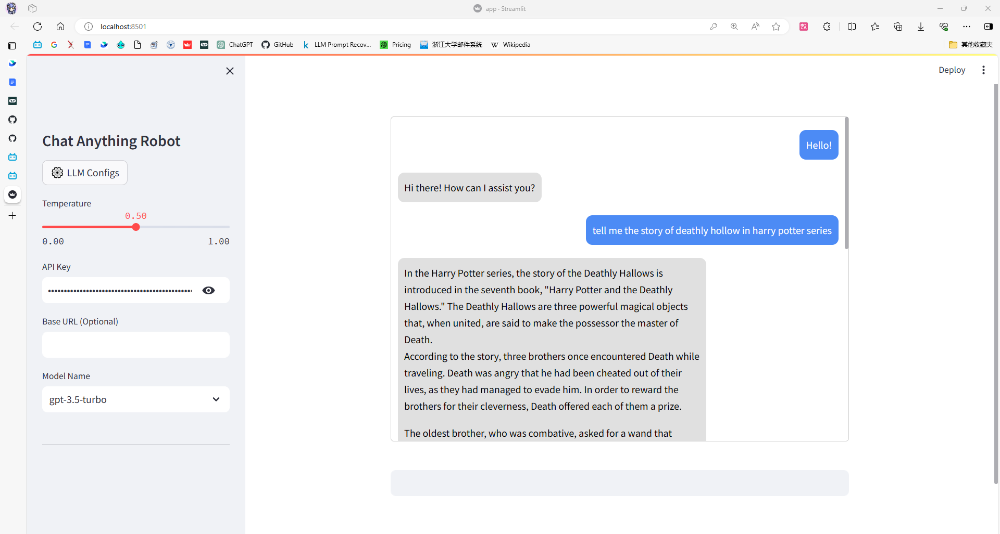

# Chat-Anything-Robot

CAR：A chat robot with any fields of given knowledge

## Quick Start

### Create Environment

<details>
<summary>pip+virtualenv</summary>

- Clone the project repository:

   ```bash
   git clone https://github.com/Bili-Sakura/Chat-Anything-Robot.git
   cd Chat-Anything-Robot
   ```

- Create and activate virtual environment:

    > Recommended python version is 3.8.x

   ```bash
   python -m venv .venv/car  # Create a virtual environment named car, located in .venv
   source .venv/car/bin/activate  # For Unix-like systems
   .\.venv\car\Scripts\activate  # For Windows
   ```  

- Install dependencies:

   ```bash
   pip install -r requirements.txt
   ```

- Deactivate the virtual environment:

   ```bash
   source .venv/car/bin/deactivate  # For Unix-like systems
   .\.venv\car\Scripts\deactivate # For Windows
   ```

</details>  

<details>
<summary>conda</summary>

- Create and activate conda environment:

   ```bash
   conda create --name car python=3.8
   conda activate car
   ```

- Install dependencies:

   ```bash
   conda install --file requirements.txt
   ```

- Deactivate the conda environment:

   ```bash
   conda deactivate
   ```

</details>

### Prepare OpenAI API KEY

[](https://openai.com/)
Follow the steps below to prepare your OpenAI API key:

1. Sign up for an account on OpenAI's website.
2. Generate an API key in your account settings.
3. Copy the API key to use in your application.

> It is avaliable to use api key transfered from supported website.
> Set base url parameter whenever you use.

### Run

```bash
cd Chat-Anything-Robot
run.bat # which equals to [cmd].venv\car\Scripts\activate + [cmd]streamlit run app.py
```

**Congratulations! You've start your own program!**


### Add Knowledge to Your Customed LLM

Put files (*.docx, *.txt, et al.) under the `data` folder.

Re-init the program, the corpus will be added into vectorstore automatically (may cost time in the first time).

## Development Notes

### Feature

- [ ] Add button for vercterization
- [ ] Add cost log info locally
- [ ] Add knowledge info in sidebar

### Fix

- [x] Asynchronously chat

### Refactor

- [x] Web Application Project Structure
